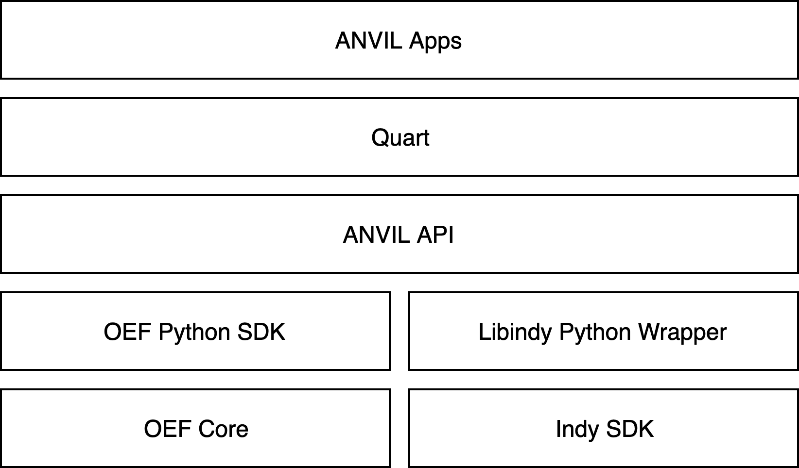
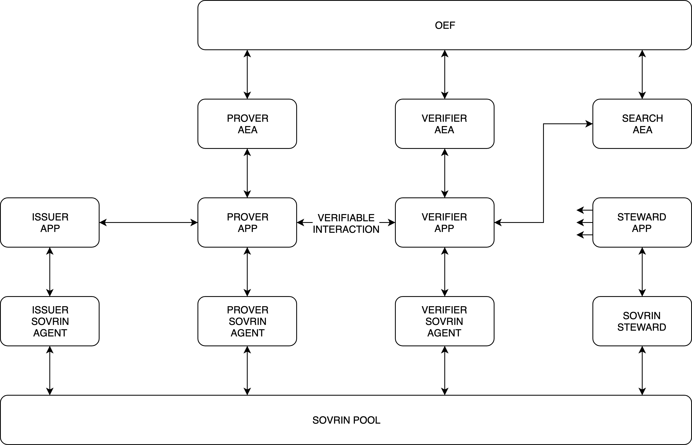
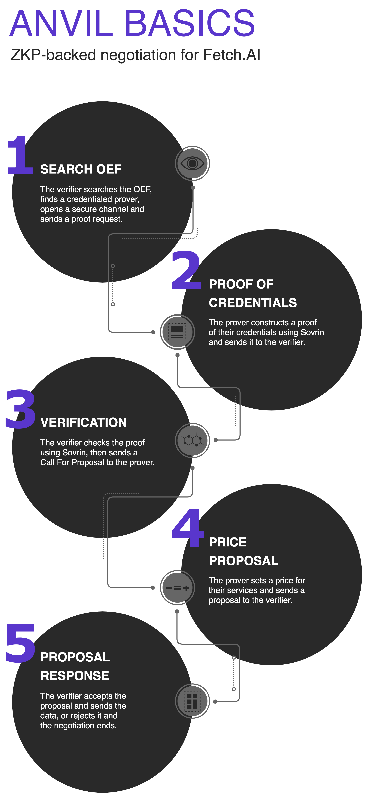
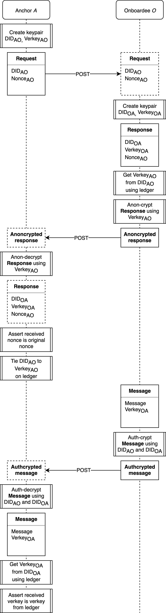

<p align="center">
    <a href="https://github.com/fetchai" alt="Fetch.AI version">
        
    </a>
    <a href="https://github.com/hyperledger/indy-sdk" alt="Hyperledger Indy version">
        
    </a>
    <br><br>
    Agent Negotiation Verifiable Interaction Layer
    <br>
    <i>An app in the Convergence Stack</i>
    <br><br>
    ANVIL bridges Fetch.AI and Sovrin, bringing trusted agents to the Open Economic Framework.
    <br>
    In short, ANVIL mitigates risk in AEA <a href="https://en.wikipedia.org/wiki/Foundation_for_Intelligent_Physical_Agents">FIPA</a> negotiations with verifiable claims.
</p>

## Requirements

- Linux/MacOS and Docker.

## Setup

The installer and install tester should be run from the root directory (the one containg this readme).

Install: `./scripts/install.sh`

Start Fetch node: `./scripts/start_fetch.sh`

Spin up Sovrin node pool: `./scripts/start_sovrin.sh`

Test install (requires a running Fetch node and Sovrin pool): `./scripts/test.sh`

Stop Fetch node: `./scripts/stop_fetch.sh`

Stop Sovrin node pool: `./scripts/stop_sovrin.sh`

The Fetch node sits on port 3333.

The Sovrin node pool sits on ports 9701 – 9708.

ANVIL apps sit on ports 5000 – 5003.

## Fundamentals

ANVIL is written in Python, making use of [Fetch.AI’s OEF Python SDK](https://github.com/fetchai/oef-sdk-python) and the [Python wrapper for HyperLedger Indy](https://github.com/hyperledger/indy-sdk/tree/master/wrappers/python). As an app in the Convergence Stack, ANVIL occupies the top three layers: it handles authentication using Sovrin’s DIDs and encrypted communication channels, querying of Fetch.AI services and various Sovrin blockchain data, serves as a UX tool for developers, as well as sports a front-end application.

<p align="center">
    
</p>

There are four key parties involved in an ANVIL interaction:
1. Steward: an exisiting trust anchor on the Sovrin ledger used to onboard the other parties to Sovrin.
2. Issuer: the issuer of the credential used by:
3. Prover: the seller in a FIPA negotiation, proving they have the credential to make them trustworthy.
4. Verifier: the buyer in a FIPA negotiation, verifying the Prover's credential.



The negotiation itself only takes place between the prover and verifier. Assuming the prover already has a credential in their wallet:

<p align="center">
    
</p>

### Using apps

Default mocked testing accounts are already set up for use without the Sovrin mainnet. If just testing, there's no need to set up the wallets section below.

#### Wallets

For real accounts, set up your address and key as environment variables *on the relevant machine and in the same session (terminal) as running the app for each actor*. You only need to set up the components you are using, e.g. in the case where actor are already Sovrin-onboarded, where there is no need for a Steward.

```
WALLET_ID=
WALLET_KEY=
```

Optionally, also set `SOVRIN_SEED=` when initialising an actor from a seed (generally only for Steward setup).

#### Run actor apps


Go to the `anvil` subfolder. Run the agent(s) of choice in a Python `venv`:

```
python3 steward.py
```
```
python3 issuer.py
```
```
python3 prover.py
```
```
python3 verifier.py
```

#### Example data

Example data is given in the `anvil/example_data` folder. This includes 2 sets of credentials and their associated proofs: an authenticated data sharing bot (_Sophos_) and a degree certificate. These can be pasted into the front-end apps.

Encoding used is personal preference. For Sophos, octal was chosen.

Fetch services are loaded in the front-end app using a path to the service data. An example service data struture can be found in the `anvil/example_data` folder.

### Sovrin verifiable claims demo

`claims.py` in the `sovrin` folder demoes the ANVIL abstractions for Hyperledger Indy. This includes a network simulator for sending data and may serve as a base for building Sovrin into various interactions.

Run:
```
python3 claims.py
```

### Secure channel setup key exchange

<p align="center">
    
</p>

## Debugging

Error: `indy.error.IndyError: ErrorCode.CommonInvalidStructure` or `indy.error.IndyError: ErrorCode.DidAlreadyExistsError`

Fix:`rm ~/.indy_client` and re-run.

Indy failures may be due to missing environment variables, see install.sh for which ones have been modified. These may need to be set in `.bashrc` (non-login interactive shells) instead of `.bash_profile`.

On a proof reply (creating a proof), the requested attributes field is what will be revealed.


### Undocumented eccentricities found while writing this software

Nonces should be fully numeric for Hyperledger Indy. This is a common cause of the `CommonInvalidStructure` error (code 113). There is an Indy-compatible nonce generator in the `sovrin/utilities` module.

Schema versions must be floats to be compatible with Sovrin.

Quart forms do not allow underscores in the `name` field.


## Fetch.AI and Sovrin quick install tools

[Fetch.AI](https://github.com/OutlierVentures/Fetch.AI-Springboard)

[Sovrin](https://github.com/OutlierVentures/Sovrin-Springboard)
