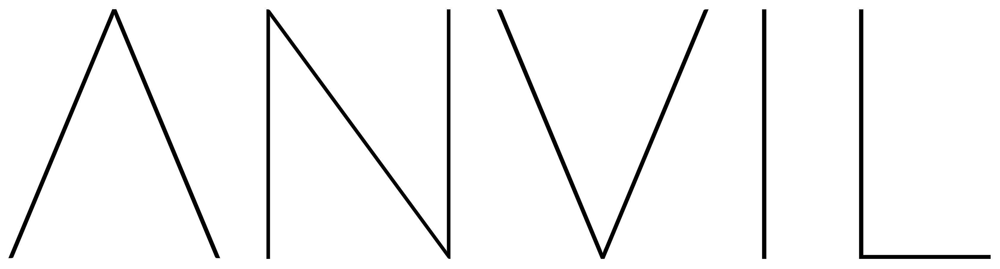

Agent Negotiation Verifiable Interaction Layer – an app in the Convergence Stack.

Bridges Fetch.AI and Sovrin, mitigating risk in AEA FIPA negotiations with verifiable claims.


## Requirements

- Linux or MacOS
- Docker


## Basics

Install: `./install.sh`

Start Fetch node: `./start_fetch_node.sh`

Spin up Sovrin node pool: `./start_sovrin_pool.sh`

Test install (requires a running Sovrin pool): `./test_install.sh`

Stop Fetch node: `./stop_fetch_node.sh`

Stop Sovrin node pool: `./stop_sovrin_pool.sh`

Nodes are currently local.

The Fetch node sits on port 3333.

The Sovrin node pool sits on ports 9701 through 9708.

### Run Fetch AEAs

Go to the `fetch` folder.

In one terminal window, run the AEA providing the service:
```
python3 verifier.py
```

In another, run the AEA purchasing it:
```
python3 prover.py
```

### Run Sovrin verifiable claims

Go to the `sovrin` folder.

Run:
```
python3 claims.py
```

### Example data

Encoding used is personal preference. For Sophos, octal has been chosen.


## Debugging

Error: `indy.error.IndyError: ErrorCode.CommonInvalidStructure` or `indy.error.IndyError: ErrorCode.DidAlreadyExistsError`

Fix:`rm ~/.indy_client` and re-run.

The `CommonInvalidStructure` error (code 113) is a [known bug of Hyperledger Indy](https://chat.hyperledger.org/channel/indy-sdk?msg=YLPrdkLR8r6Hknkf4). A workaround is currently in place for ANVIL, which tears down the connection and asks actors to try again.

Indy failures may be due to missing environment variables, see install.sh for variables. These may need to be set in `.bashrc` (non-login interactive shells) instead of `.bash_profile`.

Both the Prover and Verifier should have `data_model.json`. *ASK FETCH!! VERIFIER-SIDE: WHY DO I NEED THE DATA MODEL OF THE SERVICES I AM SEARCHING FOR (USED TO STRUCTURE QUERY)? I CAN'T POSSIBLY KNOW THE DATA MODEL BEFORE I HAVE PURCHASED THE SERVICE.*

On a proof reply (creating a proof), the requested attributes field is what will be revealed.

Schema versions must be floats to be compatible with Sovrin.


