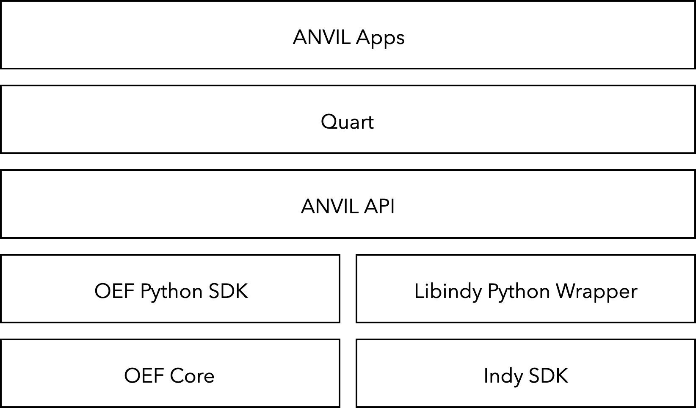
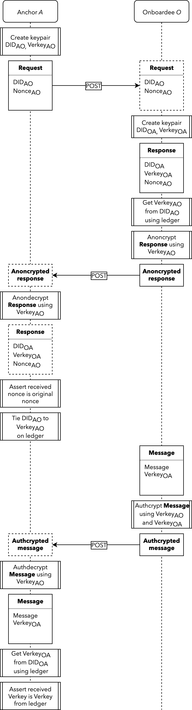

<p align="center">
    <a href="https://github.com/fetchai" alt="Fetch.AI version: Public Release 2">
        
    </a>
    <a href="https://github.com/hyperledger/indy-sdk" alt="Hyperledger Indy version: 1.8.2">
        
    </a>
    <a href="https://github.com/fetchai" alt="Fetch.AI local: supported">
        
    </a>
    <a href="https://github.com/fetchai" alt="Fetch.AI testnet: supported">
        
    </a>
    <a href="https://github.com/hyperledger/indy-sdk" alt="Sovrin local: supported">
        
    </a>
    <a href="https://github.com/hyperledger/indy-sdk" alt="Sovrin testnet: in progress">
        
    </a>
    <a href="https://github.com/hyperledger/indy-sdk" alt="Sovrin mainnet: in progress">
        
    </a>
    <br><br>
    Agent Negotiation Verifiable Interaction Layer
    <br>
    <i>An app in the Convergence Stack</i>
    <br><br>
    ANVIL bridges Fetch.AI and Sovrin, bringing trusted agents to the Open Economic Framework.
    <br>
    In short, ANVIL mitigates risk in AEA negotiations with verifiable claims.
</p>

## Requirements

- Linux/MacOS and Docker.

## Setup

The installer and install tester should be run from the root directory (the one containg this readme).

Install: `./scripts/install.sh`

Start Fetch node: `./scripts/start_fetch.sh`

Spin up Sovrin node pool: `sudo ./scripts/start_sovrin.sh`

Test install (requires a running Fetch node and Sovrin pool): `./scripts/test.sh`

Stop Fetch node: `./scripts/stop_fetch.sh`

Stop Sovrin node pool: `./scripts/stop_sovrin.sh`

The Fetch node sits on port 3333.

The Sovrin node pool sits on ports 9701 – 9708.

ANVIL apps sit on ports 5000 – 5003.

## Fundamentals

ANVIL is written in Python, making use of [Fetch.AI’s OEF Python SDK](https://github.com/fetchai/oef-sdk-python) and the [Python wrapper for HyperLedger Indy](https://github.com/hyperledger/indy-sdk/tree/master/wrappers/python). As an app in the Convergence Stack, ANVIL occupies the top three layers: it handles authentication using Sovrin’s DIDs and encrypted communication channels, querying of Fetch.AI services and various Sovrin blockchain data, serves as a UX tool for developers, as well as sports a front-end application.

<p align="center">
    
</p>

There are four key parties involved in an ANVIL interaction:
1. Steward: an exisiting trust anchor on the Sovrin ledger used to onboard the other parties to Sovrin.
2. Issuer: the issuer of the credential used by:
3. Prover: the seller in a FIPA negotiation, proving they have the credential to make them trustworthy.
4. Verifier: the buyer in a FIPA negotiation, verifying the Prover's credential.


### Using apps

Default mocked testing accounts are already set up for use without the Sovrin mainnet. If just testing, there's no need to set up the wallets section below.

#### Wallets

For real accounts, set up your address and key as environment variables *on the relevant machine and in the same session (terminal) as running the app for each actor*. You only need to set up the components you are using, e.g. in the case where actor are already Sovrin-onboarded, where there is no need for a Steward.

```
WALLET_ID=
WALLET_KEY=
```

Optionally, also set `SOVRIN_SEED=` when initialising an actor from a seed (generally only for Steward setup).

#### Run actor apps


Go to the `anvil` subfolder. Run the agent(s) of choice in a Python `venv`:

```
python3 steward.py
```
```
python3 issuer.py
```
```
python3 prover.py
```
```
python3 verifier.py
```

For local pools, for opening connections between actors use IP `0.0.0.0` appended with port `:5000` for the Steward, `:5001` for the issuer, `:5002` for the prover and `:5003` for the verifier.

Anyone already on the ledger can onboard others. To start, only Stewards are on the ledger, so for example you could use the Steward app to onboard the issuer and verifier, then your issuer app to onboard the prover.

You can change the ports on which your apps are run in each of the actor apps in the `anvil` folder.

#### Example data

Example data is given in the `anvil/example_data` folder. This includes 2 sets of credentials and their associated proofs: an authenticated data sharing bot (_Sophos_) and a degree certificate. These can be pasted into the front-end apps.

Encoding used is personal preference. For Sophos, octal was chosen.

Fetch services are loaded in the front-end app using a path to the service data. An example service data struture can be found in the `anvil/example_data` folder.

#### Call to Pull Request: a note on encrypted sessions

We'd like to have used encrypted sessions for the ANVIL Apps. This would be a **server-side** cookie in the style of the [Flask-Session](https://pythonhosted.org/Flask-Session/) extension for Flask.

The ANVIL Apps are built with the [Quart microframework](https://github.com/xutaoding/quart) to allow for the async nature of Fetch.AI and Sovrin. Unfortunately, Flask-Session does not work with Quart and there is no alternative to the extension (yet).

We welcome any pull requests implementing a server-side encrypted cookie or similar.

### Secure channel setup key exchange

ANVIL uses Sovrin's authenticated, encrypted, pairwise secure channels. The setup works as follows:

<p align="center">
    
</p>


## Developer tools

[ANVIL API reference](./API.md)

[Fetch.AI quick setup tools](https://github.com/OutlierVentures/Fetch.AI-Springboard)

[Sovrin quick setup tools](https://github.com/OutlierVentures/Sovrin-Springboard)
